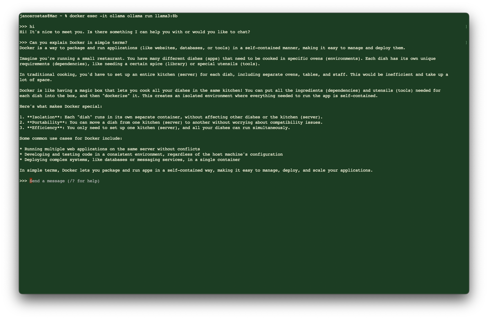

# 💬 Local LLM Chatbot

**A modular chatbot powered by a local Large Language Model (LLM), served via Docker, and designed for privacy, portability, and edge deployment.**  
Ideal for Raspberry Pi or cloud hosting (e.g., AWS), this project runs a Mistral-based LLM backend with a lightweight HTML/JS frontend, all behind an Apache2 reverse proxy.


---

<p align="center">
  <a href="https://www.linkedin.com/feed/update/urn:li:ugcPost:7350485059256172545/" target="_blank" rel="noopener noreferrer">
    
  </a>
</p>

<p align="center">
  <a href="https://www.linkedin.com/feed/update/urn:li:ugcPost:7350485059256172545/" target="_blank" rel="noopener noreferrer">▶️ Watch the demo video on LinkedIn</a>
</p>


---

## 🚀 Features

- 🧠 **Local LLM Inference**: Runs Mistral or similar models via [Ollama](https://ollama.com), no external APIs or internet access required.
- 🐳 **Dockerized Backend**: Isolated Python-based LLM backend, easily portable across environments.
- 🌐 **Simple Web UI**: Minimalist HTML/CSS/JS interface for chatting in any browser.
- 🔄 **Reverse Proxy Ready**: Integrated with Apache2 for secure access via HTTPS.
- 🍓 **Raspberry Pi Optimized**: Designed for ARM devices with low memory footprint.
- ☁️ **Cloud Deployable**: Tested on AWS EC2 and scalable to VPS or local networks.
- 🔐 **Privacy First**: All processing is done locally—your data never leaves your machine.


---

## 🧱 Tech Stack

- **Python 3** + **FastAPI**
- **Ollama** for local LLMs (e.g., `mistral`, `llama2`)
- **Docker** & **Docker Compose**
- **Apache2** reverse proxy with SSL
- **HTML/CSS/JS** frontend


---

## 📂 Project Structure

```bash
chatBot/
├── backend/              # Python API with LLM interaction
│   ├── app.py
│   └── Dockerfile
├── frontend/             # HTML/JS chat interface
│   └── index.html
├── notebooks/            # Documentation
├── docker-compose.yml    # Service orchestration
└── README.md
```


---
## 📌 Documentation

| Section                              | 	Link                                                                                                |
|--------------------------------------|------------------------------------------------------------------------------------------------------|
| 🦙 Useful ollama commands            | [ollama_commands_cheat_sheet.md](notebooks/ollama_commands_cheat_sheet.md)                           |
| ⚙️ Deployment Guide on MacBook	      | [ollama_setup_on_MacBook.md](notebooks/ollama_setup_on_MacBook.md.md)                                              |
| ⚙️ Deployment Guide on Raspberry Pi	 | [tinyllama_setup_on_raspberry_pi.md](notebooks/tinyllama_setup_on_raspberry_pi.md.md)                                              |
| 🧪 Testing & Benchmarks	             | (coming soon)                                                                                        |
| 🗂️ Useful git commands              | [git_cheat_sheet.md](https://github.com/Janos11/Robot_Web_Controller/blob/master/git_cheat_sheet.md) |


---
## 🧭 Getting Started

```bash
git clone https://github.com/Janos11/Local-LLM-Backend-Container.git
cd chatBot
docker compose up
```


## 🌍 Use Cases

- Personal assistant without giving away your data
- Offline chatbot for travel, remote sites, or IoT
- Embedded interface for smart devices or terminals
- Private family or team chat interface


## 📎 Related Projects

Automated Apache IP Update — dynamic IP reverse proxy update script
Add more links here as your project grows


## 🧠 Why This Matters

Modern AI projects often depend on external APIs, raising privacy, latency, and cost concerns. 
This project is built for local-first, edge-compatible deployment—a skillset highly relevant in 
DevOps, MLOps, and systems engineering roles, including quant firms, infrastructure teams, or R&D environments.


---
## 🤝 Contributors

<table style="font-family: Arial, sans-serif; line-height: 1.6;">
  <tr>
    <td><strong>János Rostás</strong></td>
    <td>
      👨‍💻 Electronic & Computer Engineer (Final Year Student)<br>
      🧠 Passionate about AI, LLMs, and RAG systems<br>
      🐳 Docker & Linux Power User<br>
      🔧 Raspberry Pi Builder | Automation Fanatic<br>
      💻 Git & GitHub DevOps Explorer<br>
      📦 Loves tinkering with Ollama, containerized models, and APIs<br>
      🌐 <a href="https://janosrostas.co.uk" target="_blank">janosrostas.co.uk</a><br>
      🔗 <a href="https://www.linkedin.com/in/janos-rostas/" target="_blank">LinkedIn</a><br>
      🐙 <a href="https://github.com/Janos11" target="_blank">GitHub</a> |
      🐋 <a href="https://hub.docker.com/u/janos11" target="_blank">Docker Hub</a>
    </td>
  </tr>
  <tr>
    <td><strong>ChatGPT</strong></td>
    <td>
      🤖 AI Pair Programmer by OpenAI<br>
      💡 Collaborates on brainstorming, prototyping, and debugging<br>
      📚 Built on a foundation of global programming knowledge<br>
      🔍 Assists with everything from low-level scripting to high-level LLM orchestration
    </td>
  </tr>
</table>
